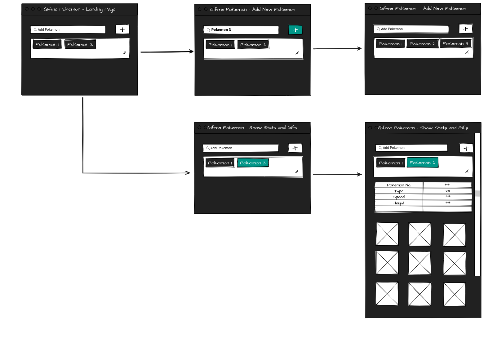

# GiphyAPI

* Childhood, for most of us, was defined by this beautiful cartoon and who doesnot like 'Pikachu'.

* This app is a fun way to find out Stats and enjoy Gifs of your favourite Pokemon.

* It uses Pokemon API and Giphy API and gives the user Stats and Gifs when a Pokemon is requested.

## Wireframe

## Technologies Used

* Javascript
* HTML5
* CSS3

## Demo

## Live Website

https://priyam009.github.io/GiphyAPI/

* Enter the name of your favourite Pokemon under 'Add and Pokemon' Search bar. Press '+' to add your Pokemon to the list of Pokemons
* From the list, select the Pokemon (any- existing or recently added) to see a table with Stats and list of all variety of Gifs related to the Pokemon selected.
* You can press any Gif to 'Pause' and 'Play'.
* Each page shows maximum of 15 gifs. Go to the next page / previous page to see more gifs.

##  Role

This app is developed by me.